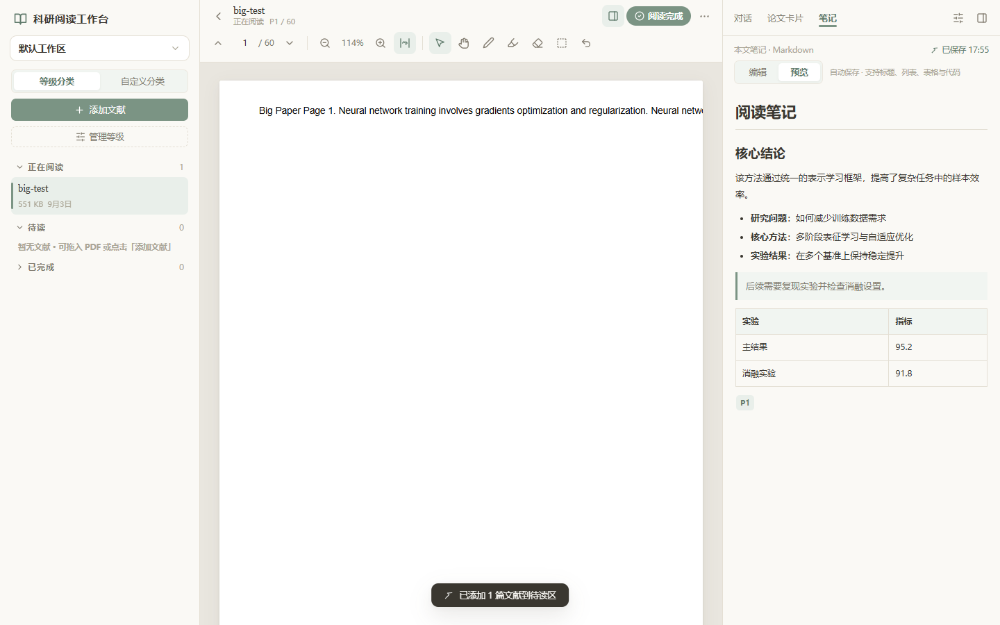
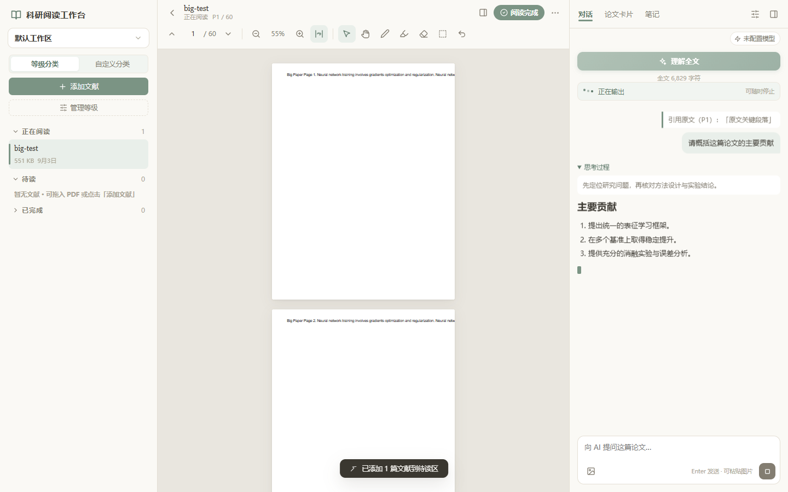
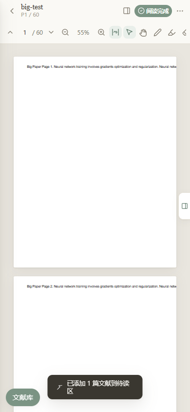

<div align="center">
  
  <h1>科研阅读工作台</h1>
  <p>把 PDF 阅读、标注、Markdown 笔记和 AI 精读放进一个本地优先的工作台。</p>
  <p>
    <a href="https://pinkman1893.github.io/research-document-workbench/">在线体验</a> ·
    <a href="https://github.com/pinkman1893/research-document-workbench/releases/latest">下载便携版</a> ·
    <a href="docs/USER_GUIDE.md">使用指南</a> ·
    <a href="https://github.com/pinkman1893/research-document-workbench/issues">问题反馈</a>
  </p>
  <p>
    
    
    
    
  </p>
</div>



## 为什么做这个项目

科研阅读常被拆散在 PDF 阅读器、笔记软件、聊天窗口和文献表格之间。科研阅读工作台把这些动作收进同一条工作流，同时把论文和笔记保留在当前浏览器中。

- **阅读不中断**：连续阅读、适宽缩放、小手拖拽、稳定恢复上次位置。
- **证据可回看**：文本高亮、手写标注、区域截图，以及可点击的 `[P12|原文]` 引用。
- **笔记可沉淀**：每篇论文独立的 Markdown 编辑与预览。
- **AI 可选择**：不配置模型也能完整阅读和记笔记；配置后可流式问答、查看思考过程并生成论文卡片。
- **资源有边界**：离屏画布释放、过期任务取消、渲染并发和像素预算，避免长论文越读越卡。
- **键盘可操作**：阅读工具、文献菜单和弹窗具备清晰名称、焦点反馈与合理的导航顺序。

| 流式 AI 精读（需自行配置模型） | 390px 窄屏笔记 |
| --- | --- |
|  |  |

## 立即使用

### 在线体验

打开 **[pinkman1893.github.io/research-document-workbench](https://pinkman1893.github.io/research-document-workbench/)**。

在线版和本地版的数据相互独立，数据都保存在对应站点的浏览器存储中。在线版的 AI 功能要求模型网关允许该 GitHub Pages 域名进行 CORS 请求。

### 下载便携版

从 [Releases](https://github.com/pinkman1893/research-document-workbench/releases/latest) 下载 `research-document-workbench-v*.zip`，解压后启动：

| 平台 | 启动方式 | 运行要求 |
| --- | --- | --- |
| Windows | 双击 `启动工作台.bat` 或 `start-workbench.bat` | Python 3.9+，现代浏览器 |
| macOS | 双击 `start-workbench.command`；首次可能需在终端运行 `chmod +x start-workbench.command start.sh` | Python 3.9+，现代浏览器 |
| Linux | 运行 `./start.sh` | Python 3.9+，现代浏览器 |
| 任意平台 | `python tools/serve.py` | Python 3.9+ |

浏览器会打开 `http://localhost:8642/`。运行应用不需要 Node.js、npm、账户或后端。

也可以克隆源码：

```bash
git clone https://github.com/pinkman1893/research-document-workbench.git
cd research-document-workbench
python tools/serve.py
```

> 不要直接双击 `index.html`。浏览器的 PDF module worker 需要通过 HTTP 加载。

## 主要功能

### PDF 阅读与标注

- 连续页面、页码跳转、适宽与 30%–400% 缩放
- Ctrl + 滚轮缩放和放大页面的小手拖拽
- 画笔、整次手势橡皮擦、撤销、多色文本高亮
- 划选原文提问、区域截图提问和引用回跳
- 只渲染视口附近页面，离屏回收 PDF/ink 位图

### Markdown 笔记

- 原文编辑与安全预览
- 标题、粗斜体、删除线、任务列表、引用、表格和代码块
- 每次输入自动保存，切换论文前等待提交
- `[P页码|片段]` 渲染为 PDF 跳转锚点
- 危险 HTML 和 URL 协议经过 DOMPurify 清洗

### 可选 AI 能力

- OpenAI 兼容的 `/chat/completions` 接口
- SSE 流式正文与思考过程
- “读取论文 / 等待响应 / 思考中 / 正在输出”状态反馈
- 随时停止并保留已收到的内容
- 全文结构化论文卡片、引用页码和 token/费用记录

AI 不是必需功能。项目不提供模型服务、代理后端或 API Key。

## 数据与隐私边界

| 内容 | 存储或发送位置 |
| --- | --- |
| PDF、标注、笔记、卡片、聊天记录 | 当前站点的浏览器 IndexedDB |
| 模型配置和 API Key | 当前站点的 localStorage |
| 关闭前未提交编辑 | localStorage 恢复日志 |
| AI 请求内容 | 直接发送到你配置的模型网关 |

项目没有服务器接收你的论文。**启用 AI 后，相关论文文本、选中引用、图片和对话会发送到你选择的模型网关，API Key 也会用于该请求。** 请只配置可信的 HTTPS 服务，阅读其隐私政策，并避免在共享浏览器中保存密钥。

localhost、127.0.0.1、不同端口和 GitHub Pages 属于不同浏览器 origin，数据不会自动迁移。当前版本尚未提供一键数据导出；请保留原 PDF，且不要清除仍需使用的站点数据。

更多说明见 [用户指南](docs/USER_GUIDE.md) 和 [安全政策](SECURITY.md)。

## 常见问题

<details>
<summary>不配置 AI 能使用吗？</summary>

可以。PDF 阅读、工作区、分类、标注和 Markdown 笔记都不依赖 AI。
</details>

<details>
<summary>为什么页面是空的，之前的数据去了哪里？</summary>

先检查地址是否仍为 `http://localhost:8642/`。换成 127.0.0.1、其他端口或在线体验地址时，浏览器会使用另一份存储空间。
</details>

<details>
<summary>为什么模型连接成功，但请求失败？</summary>

模型服务需要兼容 OpenAI Chat Completions，并允许当前页面 origin 的 CORS。在线版尤其需要网关允许 `https://pinkman1893.github.io`。部分网关不支持 `reasoning_effort` 或思考字段，应用会尽量回退，但不能保证所有厂商行为一致。
</details>

<details>
<summary>数据会同步到其他设备吗？</summary>

不会。当前版本是单机浏览器存储，没有云同步。更换设备或浏览器不会自动带出数据。
</details>

<details>
<summary>端口 8642 被占用怎么办？</summary>

如果工作台已经运行，刷新已有标签页即可。否则先关闭占用端口的程序，再重新运行启动器。也可运行 `python tools/serve.py --port 8643`，但新端口会使用另一份浏览器数据。
</details>

## 文档

- [完整用户指南](docs/USER_GUIDE.md)
- [贡献指南](CONTRIBUTING.md)
- [更新记录](CHANGELOG.md)
- [安全政策](SECURITY.md)
- [第三方许可](THIRD-PARTY-NOTICES.md)

## 开发与验证

项目是无框架、无编译步骤的静态浏览器应用。运行只需要 Python；贡献代码时需要 Node.js 来执行 JavaScript 语法检查。

```bash
python tools/check.py
python tools/package_release.py --version 1.2.0
```

`tools/check.py` 检查自有 JavaScript、Python 工具、HTML 本地资源、固定版本依赖和个人绝对路径。涉及 PDF、保存或 AI 流式请求的修改，还应使用独立浏览器 origin 做真实交互回归。

```text
+-- index.html
+-- css/style.css
+-- js/
+|   +-- reader.js          # PDF 渲染、手势和标注
+|   +-- ai.js              # AI 对话、卡片和笔记
+|   +-- markdown.js        # Markdown 安全渲染
+|   +-- state.js           # 工作区、论文和导航
+|   +-- db.js              # IndexedDB 与模型配置
+|   +-- recovery.js        # 关闭恢复日志
+-- tools/
+|   +-- serve.py           # 本地 loopback 服务
+|   +-- check.py           # 发布检查
+|   +-- package_release.py # 用户版 ZIP
\-- vendor/                 # 固定版本运行依赖
+```

## 路线图

- 数据导出、导入和可验证备份
- 文献搜索与全文检索
- 键盘快捷键和可配置阅读主题
- 可选的 OCR 与文献元数据提取
- 更完整的自动化浏览器回归

欢迎通过 [Issues](https://github.com/pinkman1893/research-document-workbench/issues) 反馈问题或提出建议，也欢迎阅读 [CONTRIBUTING.md](CONTRIBUTING.md) 后提交 Pull Request。

## License

本项目采用 [MIT License](LICENSE)。PDF.js、DOMPurify 和 Marked 使用各自许可证，详见 [THIRD-PARTY-NOTICES.md](THIRD-PARTY-NOTICES.md)。
